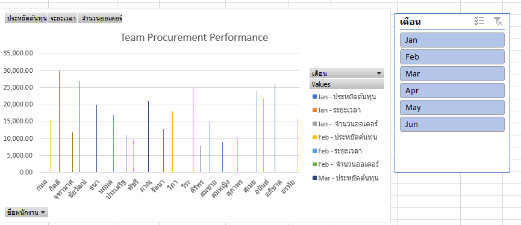

# Procurement Team KPI Analysis

## Objective
Analyze procurement team performance using key metrics such as order volume, lead time, and cost savings.

## Tools
- Microsoft Excel
- Pivot Table
- Data Visualization (Charts)

## Project Steps
1. Create mock data (50 records)
2. Build pivot tables to summarize KPIs
3. Visualize performance using charts
4. Organize into a clean portfolio layout

## Key Insights
- Identified top-performing employees based on order volume
- Analyzed average lead time to find delays
- Evaluated cost-saving contributions across the team

## Files
- `Procurement_KPI.xlsx` – Main analysis file

